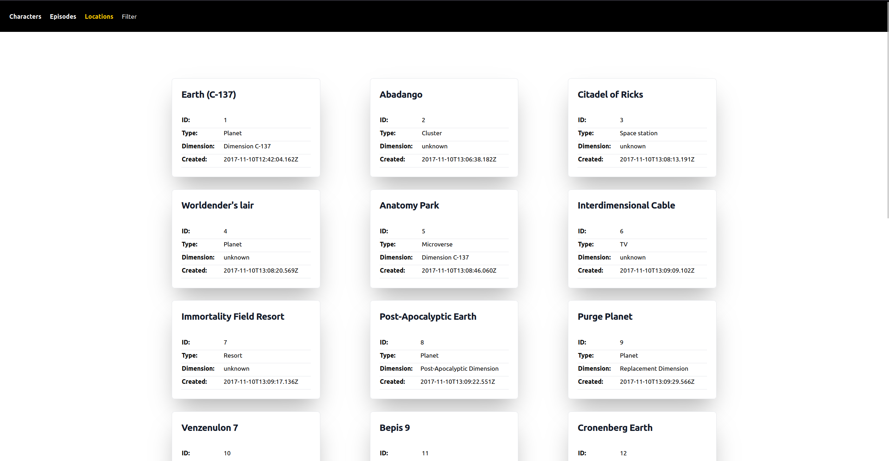
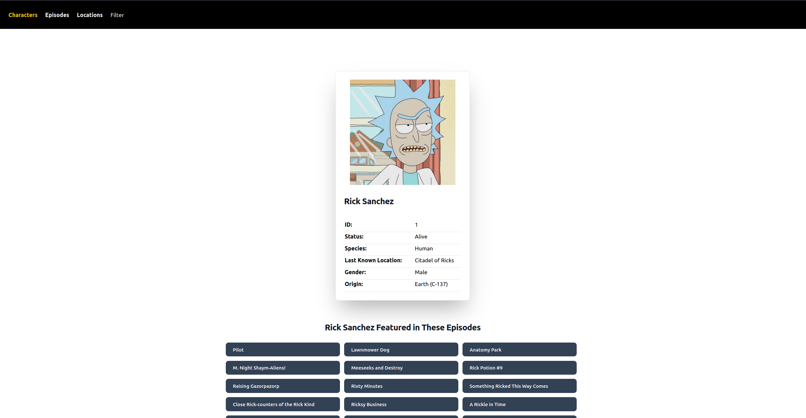

This program works with api.
https://rickandmortyapi.com/api/

With its help, you can view information about Rick And Morty Characters, locations and episodes.

Rick and Morty is an American adult animated science-fiction sitcom created by Justin Roiland and Dan Harmon for Cartoon
Network's nighttime programming block Adult Swim.

## Getting started

- run `git clone https://github.com/algisbernatovics/rick-and-morty.git`
- run `composer install` to get necessary packages
- run `npm install` to get necessary packages
- run `npx tailwindcss build -o public_html/styles/tailwind.css` -optional, to rebuild tailwind.css
- run `php -S localhost:7777` from public_html folder to start server
- click on site that appears in terminal to open it in browser
- try,be happy!