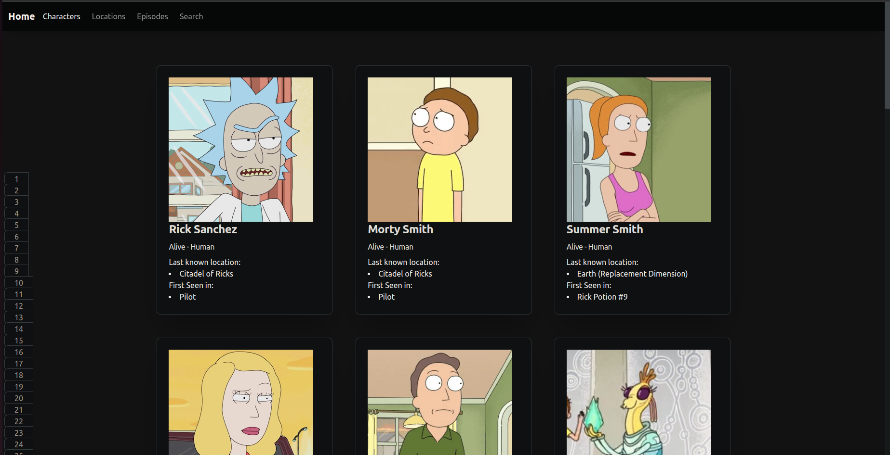
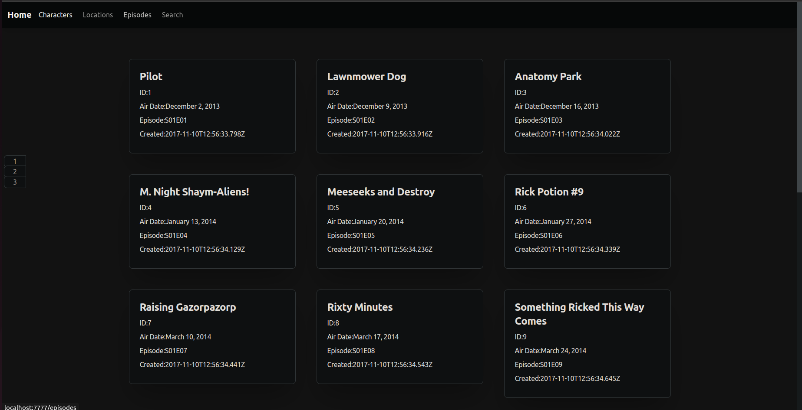

This program works with api.
https://rickandmortyapi.com/api/

With its help, you can view information about Rick And Morty Characters, locations and episodes.

Rick and Morty is an American adult animated science-fiction sitcom created by Justin Roiland and Dan Harmon for Cartoon
Network's nighttime programming block Adult Swim.

## Getting started

- download project
- create empty 'cache' folder into directory 'the-rick-and-morty-main'
- run `composer install` to get necessary packages
- run `php -S localhost:7777` from public folder to start server
- click on site that appears in terminal to open it in browser
- have fun!

The program is writed in PHP and includes
"guzzlehttp/guzzle": "^7.5",
"nikic/fast-route": "^1.3",
"twig/twig": "^3.5",
"ext-json": "*"
